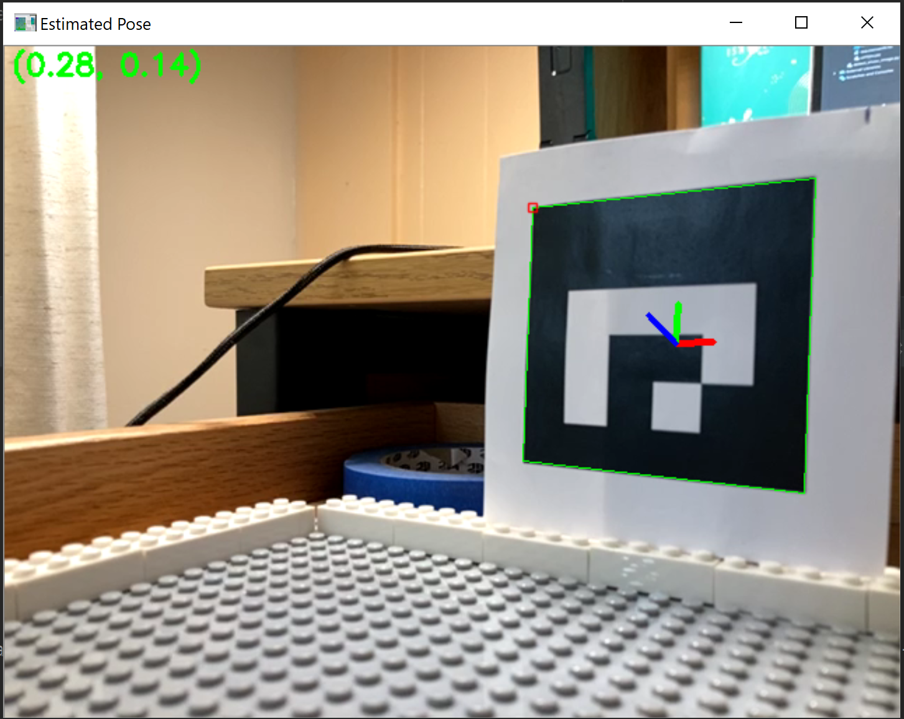
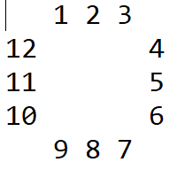

# ArUCo-Markers-Pose-Estimation-Generation-Python

This repository contains the code to calibrate your camera, and track the location of the camera based on ArUco markers. 

## 1. Calibrating the Camera
The file `calibration.py` contains the code for calibrating the camera. If you are using the ESP32-Cam, then `calibration_matrix_esp.npy` and `distortion_coefficients_esp.npy` already contain the ESP32-Cam's calibration based on my results. Also `chessboard_esp32` contains pictures of a chessboard I took with my ESP32-Cam that can be used to calibrate the camera (square size of the chessboard is 0.24 cm). 

The command for running `calibration.py` is:
`python calibration.py --dir chessboard_esp32/ --square_size 0.024`

You can find more details on other parameters using `python calibration.py --help`

## 2. ArUco Marker Setup
The file `maze.txt`  contains the ArUco marker setup for your maze. You can modify this file for your maze set-up. The file should contain the same number of ArUco IDs for the first and last row, and exactly 2 IDs for the other rows. Here is an example `maze.txt` for a 3x3 maze:

The code ignores extra whitespace, so you just have to ensure you have the right number of IDs on each row.

## 3. Pose Estimation  
The file `pose_estimation.py` contains the code that performs pose estimation after detecting the ArUco markers. You need to specify the path to the camera calibration matrix and distortion coefficients. The default type of ArUco marker to detect is from the dictionary `DICT_4X4_50`, and this can be changed with the `--type` parameter. If the detected ArUco ID is part of `maze.txt` then the code will print your current location in the maze. 

The command for running is :-  
`python pose_estimation.py --K_Matrix calibration_matrix.npy --D_Coeff distortion_coefficients.npy --type DICT_4X4_50 --Aruco maze.txt`  

You can find more details on other parameters using `python pose_estimation.py --help`  

### <ins>Notes</ins>
The `utils.py` contains the ArUCo Markers dictionary and the other utility function to display the detected markers.  
  
Video of pose estimation here: [Link](https://youtu.be/r-C-9VYqLN8)
